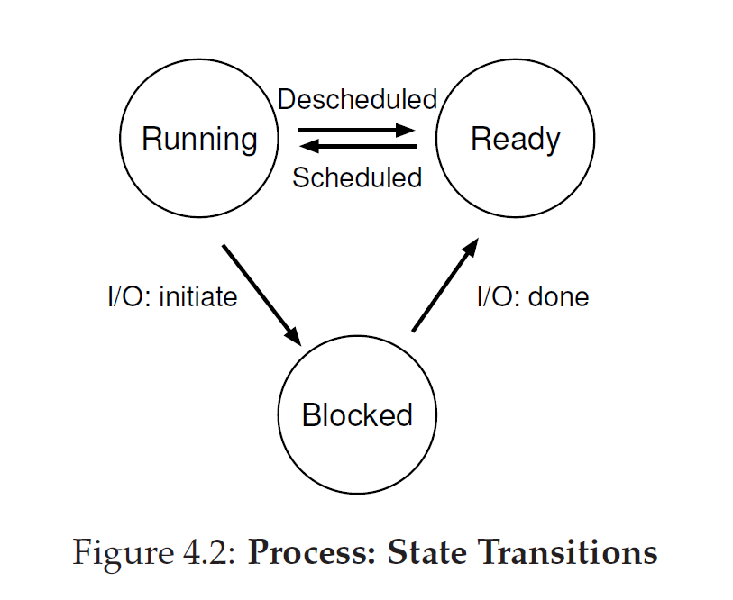

# rusty-os

rusty-os is a simple kernel for embedded systems written in Rust

What does an OS actually do?

It takes physical resources, such as a CPU, memory, or disk, and **virtualizes** them. It
handles tough and tricky issues related to **concurrency**. And it stores files
**persistently**, thus making them safe over the long-term. Given that we
want to build such a system, we want to have some goals in mind to help
focus our design and implementation and make trade-offs as necessary;
finding the right set of trade-offs is a key to building systems.

- One of the most basic goals is to build up some **abstractions** in order
to make the system convenient and easy to use.

- One goal in designing and implementing an operating system is to
provide **high performance**; another way to say this is our goal is to **minimize
the overheads** of the OS.

- Another goal will be to provide **protection** between applications, as
well as between the OS and applications. Protection is at the heart of one of the
main principles underlying an operating system, which is that of isolation; isolating
processes from one another is the key to protection and thus underlies much of what an
OS must do.

- The operating system must also run non-stop; when it fails, all applications
running on the system fail as well. Because of this dependence,
operating systems often strive to provide a high degree of **reliability**.

- Other goals make sense: **energy-efficiency** is important in our increasingly
green world; **security** (an extension of protection, really) against
malicious applications is critical, especially in these highly-networked
times; **mobility** is increasingly important as OSes are run on smaller and
smaller devices.

## Process API

These APIs, are available on Rusty-OS:

- Create
- Destroy
- Wait
- Miscellaneous Control - such as suspending and resuming a process.
- Status

A process can be in one of three states:

- Running
- Ready
- Blocked

  
## Data Structures

rusty-os has some key data structures that tracks relevant pieces of information.

- Proces List: To track the state of each process, the OS will keep a process
list for all processes that are ready, as well as some additional information
to track which process is currently running.

- Register context: will hold, for a stopped process, the contents of its register state. When a process is
stopped, its register state will be saved to this memory location; by restoring these registers (i.e., placing
their values back into the actual physical registers), the OS can resume running the process. This technique is
known as a context switch.
 